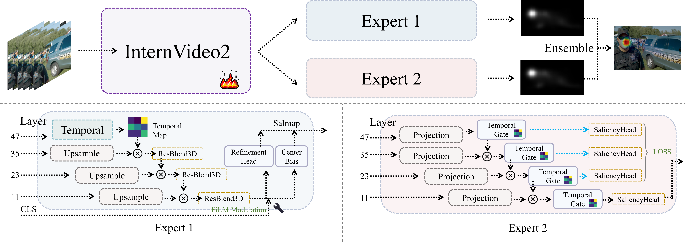
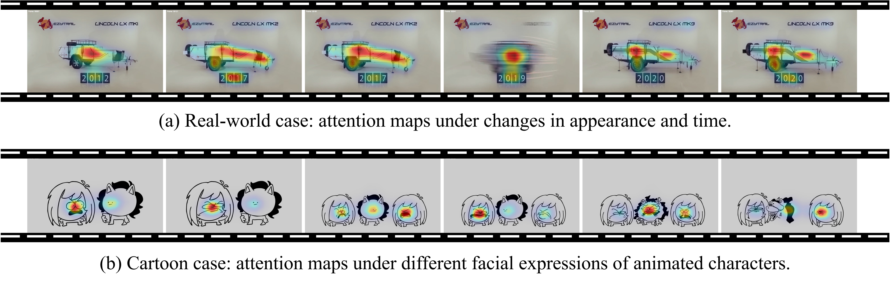

<div align="center">

# 🚀 ViSAGE @ NTIRE 2026 Challenge on Video Saliency Prediction (CVPR 2026)

### Official PyTorch Implementation of **"ViSAGE"**

[](https://arxiv.org/abs/xxxx.xxxxx)
[](https://your-project-page.github.io/)
[](https://your-demo-link.com)
[](./LICENSE)

**Kun Wang**<sup>1</sup>, **Yupeng Hu**<sup>1</sup>, **Zhiran Li**<sup>1</sup>, **Hao Liu**<sup>1</sup>, **Qianlong Xiang**<sup>2</sup>, **Liqiang Nie**<sup>2</sup>

<sup>1</sup> School of Software, Shandong University, Jinan, China  
<sup>2</sup> School of Computer Science and Technology, Harbin Institute of Technology, Shenzhen, China

</div>
  
---

<p align="center">
  <video src="https://github.com/user-attachments/assets/a2dbabc0-9d8e-4f7a-8b16-c2d56af7b071" controls width="95%"></video>
</p>


---

## 📌 Introduction

This repository is the official implementation of **ViSAGE** for the paper **"ViSAGE @ NTIRE 2026 Challenge on Video Saliency Prediction"**.


This repo includes:

- training code
- inference code
- evaluation scripts
- pretrained checkpoints


---

## 📰 News

- **[2026/04/08]** Initial release of the repository.
- **[2026/04/08]** Released inference code and pretrained checkpoints.
- **[2026/04/08]** Released training and evaluation pipeline.

---

## 🍽 TODO

- [x] Release README
- [x] Release inference code
- [x] Release training code
- [x] Release evaluation code
- [x] Release pretrained checkpoints
- [ ] Release demo page
- [ ] Release additional models

---

## ✨ Highlights

- Robust Video Saliency Prediction (VSP) leveraging a multi-expert ensemble framework.
- Temporal Modulation + Multi-Scale Fusion experts for explicit spatial priors and adaptive data-driven perception.
- Support for two-stage LoRA fine-tuning, multi-expert ensemble inference, and evaluation utilities.


---

## 🧠 Method Overview

<p align="center">
  
</p>

Our method consists of three main components:

1. **Shared Video Backbone**  for extracting multi-scale spatio-temporal representations via LoRA adaptation.
2. **Dual Specialized Experts** for predicting saliency using complementary inductive biases (temporal modulation and multi-scale fusion).
3. **Ensemble Fusion Module** for averaging expert predictions at inference to achieve robust and generalizable estimation.


---

## 📊 Results

### Main Quantitative Results

| Team / Method | Dataset | CC | SIM | AUC Judd | NSS |
|---------------|---------|----|-----|----------|-----|
| Baseline | NTIRE 2026 Private Test | 0.410 | 0.408 | 0.691 | 1.305 |
| ARK MMLAB | NTIRE 2026 Private Test | 0.790 | 0.660 | 0.891 | **3.456** |
| CVSP | NTIRE 2026 Private Test | 0.827 | 0.664 | **0.898** | 3.416 |
| **ViSAGE (Ours)** | NTIRE 2026 Private Test | **0.828** | **0.693** | 0.892 | 3.323 |

### Qualitative Results

<p align="center">
  
</p>

### Video Examples

<p align="center">
  <video src="https://github.com/user-attachments/assets/a2dbabc0-9d8e-4f7a-8b16-c2d56af7b071" controls width="95%"></video>
</p>

---

## ⚙️ Installation

### 1. Clone the repository

```bash
git clone https://github.com/iLearn-Lab/ViSAGE.git
cd ViSAGE
```

### 2. Create environment

```bash
conda create -n visage python=3.10 -y
conda activate visage
pip install -r requirements.txt
```

---

## 🗂️ Repository Structure

```bash

ViSAGE/
├── assets/
├── Expert1/               # Expert 1 core (temporal modulation & spatial priors)
├── Expert2/               # Expert 2 core (multi-scale fusion & auxiliary supervision)
├── InternVideo/           # InternVideo2 backbone and LoRA adaptation modules
├── prediction/
├── predictvideos/
├── submission/            # Scripts and configs for the final NTIRE 2026 submission
├── ensemble.py            # Inference script for fusing dual-expert predictions
├── video_to_frames.py     # Data preprocessing: extracting frames from videos
├── makevideos.py          # Visualization: overlaying saliency maps onto original videos
├── check.py
├── TrainTestSplit.json
├── Dockerfile             # Environment setup for consistent reproduction
├── requirements.txt
└── README.md
```

---


## 💾 Checkpoints

The cloud links of checkpoints: [Google Drive](https://drive.google.com/drive/folders/1qePuGCeaCudEkx0uauX2BblRlno9lHmv?usp=sharing).

---

## 📂 Pre-trained Weights Preparation

Our model utilizes InternVideo2 as the shared visual encoder. Before running the evaluation, please download the pre-trained weights.

1. Download the pre-trained model (`InternVideo2-Stage2_6B-224p-f4`) from Hugging Face:
   [OpenGVLab/InternVideo2-Stage2_6B-224p-f4](https://huggingface.co/OpenGVLab/InternVideo2-Stage2_6B-224p-f4)

   Download the model code (`InternVideo`)
   ```bash
    git clone https://github.com/OpenGVLab/InternVideo.git
    ```

2. Once downloaded, update the pre-trained weight paths in the following inference scripts to match your local directory:
   - `Expert1/inference.py`
   - `Expert2/inference.py`

##  💽 Data Preparation

We use the datasets and splits produced by [NTIRE26 Challenge](https://www.codabench.org/competitions/12842/). 

Use the provided `video_to_frames.py` script to extract frames from the source videos. The extracted frames will be automatically saved to the `derived_fullfps` directory.


> **⚠️ Important Notice:**
> Please **do not modify** this output directory name (`derived_fullfps`) or any subsequent default output folder names. If you choose to change them, you must manually update the corresponding path configurations across the relevant inference scripts to match your new directory structure.


##  ⚡ Inference

To generate the final predictions, you need to run the inference scripts for both Expert 1 and Expert 2. You can execute the following commands from the root directory of the project:

```bash
# Run inference for Expert 1
python Expert1/inference.py

# Run inference for Expert 2
python Expert2/inference.py
```
### Hardware Requirements & Performance Benchmark

Our models have been tested and profiled on a single **NVIDIA RTX PRO 6000 Blackwell Server Edition (96GB)** GPU. The performance metrics for a single inference run are as follows:

* **VRAM Consumption:** Approximately **18 GB** per inference process. 
* **Inference Time:** Takes about **4.5 hours** to complete the full dataset evaluation.
* **Processing Speed:** Achieves an efficient processing speed of approximately **30 FPS**.
* **Challenge Compliance:** This performance significantly exceeds the minimum speed requirement of **1 FPS** set by the competition guidelines.


##  Ensemble and Final Video Generation

After obtaining the individual predictions from both experts, you can proceed to ensemble the results, verify the output format, and generate the final visualization videos. Please ensure you run the following commands from the root directory of the project.

###  Ensemble Predictions
First, run the ensemble script to merge the inference results from Expert 1 and Expert 2. This will combine the strengths of both models to produce a more robust final prediction:

```bash
python ensemble.py
```
###  Output Verification

Next, it is crucial to verify that the ensembled outputs strictly comply with the NTIRE challenge submission requirements. Run the check script to validate the format and content of your prediction files:

```bash
python check.py
```
###  Synthesize Final Videos

Finally, to visualize the ensembled results, use the video generation script. This will render the predicted saliency outputs onto the source video frames:

```bash
python makevideos.py
```

The generated final videos will be saved in the designated output directory (e.g., `./predictvideos/final`), ready for qualitative evaluation or demonstration.

## 🚀 Training


Stage1 Training:

```bash
python trainnew.py 
```

Stage2 Training:

```bash
python trainnew2.py
```


---


## 📚 Citation

If you find this project useful for your research, please consider citing:

```bibtex
@inproceedings{ntire26visage, 
title={{    ViSAGE @ NTIRE 2026 Challenge on Video Saliency PredictionNTIRE 2026 Challenge on Video Saliency Prediction: Methods and Results    }}, 
author={    Kun Wang, Yupeng Hu and  Zhiran Li, Hao Liu,  Qianlong Xiang and Liqiang Nie    },   
booktitle={Proceedings of the IEEE/CVF Conference on Computer Vision and Pattern Recognition (CVPR) Workshops},  
year = {2026} 
}
```

---

## 📄 License

This project is released under the [Apache 2.0 License](./LICENSE).

---

## 📬 Contact

If you have any questions, feel free to open an issue or contact:

- Author Kun Wang: `khylon.kun.wang@gmail.com`

